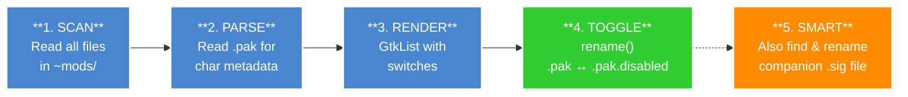

<div align="center">

# 🐦‍⬛ Crow

### *Your mods. One switch away.*

**A lightweight, native Linux mod loader for Guilty Gear -Strive-.**

[](https://en.cppreference.com/w/c/17)
[](https://gtk.org/)
[](https://kernel.org)
[](LICENSE)

[Features](#-features) • [Quick Start](#-quick-start) • [How It Works](#-how-it-works) • [Build](#-build) • [Project Structure](#-project-structure)

</div>

---

> *"Toggle mods, not your sanity."* 🎮

Crow is a dead-simple mod manager for **Guilty Gear -Strive-** on Linux. No Java runtime, no Electron, no bloat — just a fast, native GTK4 app that feels right at home on your GNOME desktop.

Point it at your GGST install, and it gives you a clean list of switches to flip your mods on and off. That's it.

---

## ✨ Features

| Feature | Details |
|---------|---------|
| 🔀 **One-Click Toggle** | Enable/disable mods instantly with a `GtkSwitch` |
| 📦 **Easy Install** | Install mods via Drag & Drop or the "Add Mod" button |
| 🎭 **Auto Character Tag** | Scans inside `.pak` binaries to auto-detect characters |
| 🔍 **Mod Search** | Find mods instantly by name with real-time filtering |
| 🏷️ **Status Filter** | Filter the list by All Mods, Enabled, or Disabled |
| 🔗 **Smart .sig Handling** | Automatically renames companion `.sig` files alongside `.pak` |
| 📁 **XDG-Compliant Config** | Saves your GGST path to `~/.config/crow/config.ini` |
| 🖥️ **Native GTK4 UI** | `GtkHeaderBar`, `GtkListView`, feels native on GNOME |
| 🔄 **Refresh on Demand** | Rescan the `~mods` directory any time |
| 📭 **Empty State** | Clean placeholder when no mods are found |
| ⚡ **Lightweight** | Pure C binary — a few MB, zero runtime dependencies |

---

## ⚡ Quick Start

```bash
# Clone & build
git clone https://github.com/moemairu/crow.git
cd crow && cmake -B build && cmake --build build

# Fly 🐦‍⬛
./build/crow
```

On first launch, Crow will ask you to select your GGST install directory. After that, your mods appear with toggle switches. Done. 🎯

---

## 🎬 How It Works



GGST (Unreal Engine 4) loads mods from:

```
[GGST_INSTALL_DIR]/RED/Content/Paks/~mods/
```

- Files ending in `.pak` → **Enabled** mods
- Files ending in `.pak.disabled` → **Disabled** mods

Crow simply renames files between these two states. It also proactively hunts for the companion `.sig` signature file and renames it too — because nobody likes orphaned sigs.

---

## 🔨 Build

### Prerequisites

- **GTK4** (≥ 4.10)
- **CMake** (≥ 3.20)
- **pkg-config**
- A C17-capable compiler (GCC or Clang)

Install them on common Linux distributions:

- **🐧 Arch Linux / Manjaro / EndeavourOS:**
  ```bash
  sudo pacman -S gtk4 cmake base-devel
  ```
- **🐧 Ubuntu / Debian / Pop!_OS (22.04+):**
  ```bash
  sudo apt install libgtk-4-dev cmake build-essential
  ```
- **🐧 Fedora / RHEL:**
  ```bash
  sudo dnf install gtk4-devel cmake gcc
  ```

### Compiling Crow

```bash
cmake -B build            # Configure
cmake --build build       # Build
./build/crow              # Run 🐦‍⬛
```

---

## 🏗️ Project Structure

```
crow/
├── CMakeLists.txt            # 🔧 CMake build config (C17 + GTK4)
├── README.md                 # 📖 You are here! 👋
├── .gitignore
├── include/
│   ├── config.h              # ⚙️ XDG config load/save
│   ├── crow_mod.h            # 🎯 Mod data model, scanner, toggle
│   ├── crow_pak.h            # 📦 Unreal Engine .pak parser for metadata
│   └── crow_window.h         # 🖼️ Main application window
└── src/
    ├── main.c                # 🚀 GtkApplication entry point
    ├── config.c              # 📝 GKeyFile-based config management
    ├── crow_mod.c            # 🔀 GObject mod model + file operations
    ├── crow_pak.c            # 📦 Fast binary parsing & fallback heuristics
    └── crow_window.c         # 🖥️ UI: HeaderBar, ListView, DND, empty state
```

---

## 🛠️ Technical Details

| | |
|---|---|
| **Language** | C (C17 standard) |
| **UI Toolkit** | GTK4 (GtkListView, GtkHeaderBar, GtkFileDialog) |
| **Platform** | Linux |
| **Config** | GKeyFile (INI format) via XDG Base Directory |
| **Build** | CMake ≥ 3.20 |
| **Compiler Flags** | `-std=c17 -Wall -Wextra -Wpedantic` |
| **Dependencies** | GTK4 (only) |

---

## 🚀 Roadmap

- [x] ~~Core mod toggle (.pak ↔ .pak.disabled)~~ ✅
- [x] ~~Smart .sig companion handling~~ ✅
- [x] ~~XDG-compliant configuration~~ ✅
- [x] ~~Mod search & status filter~~ ✅
- [x] ~~Native character auto-detection (`.pak` parser)~~ ✅
- [x] ~~Drag-and-drop mod installation~~ ✅
- [ ] Load order management
- [ ] Mod profiles (presets)

---

## 📜 License

MIT — do whatever you want. Just keep fighting. 🐦‍⬛

---

<div align="center">

*Crow does one job well: flipping your Strive mods on and off.*

**Toggle mods, not your sanity.** 🐦‍⬛🎮

</div>
